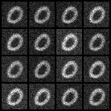
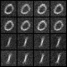
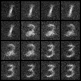
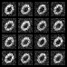
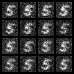
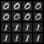
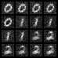
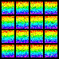
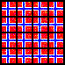

# Quantum Diffusion Model

This repository showcases a novel implementation of a Quantum Diffusion Model, developed by Markus Leitvoll and Nikolai Kivijervi. The project was conducted as part of a master’s thesis, in collaboration with Simula Research Laboratory and the University of Oslo.

## Abstract

Diffusion models excel in image generation and manipulation but suffer from
significant computational demands and slow sampling. Quantum computing
offers the potential to overcome these challenges. This thesis explores
the integration of quantum computing with diffusion models, introducing
a novel Quantum Diffusion Model (QDM) with four distinct variants
implemented using Parameterized Quantum Circuits. This work investigates
both grayscale and, for the first time, full-color image generation using
QDMs, and explores the impact of our novel timestep and label embedding
techniques. Our results demonstrate the promising capabilities of QDMs,
particularly those utilizing ancilla qubit-powered temporal context. This
thesis shows that QDMs offer the potential for improved scalability compared
to classical diffusion models, enabling the generation of larger images and
potentially achieving faster sampling speeds.

## Images produced by the model

#### MNIST 32x32

   

#### MNIST 16x16

   

#### COLOR IMAGES 16x16

  

## Master thesis

Here is the master theisis:
[Quantum_Diffusion_Model.pdf](/Quantum_Diffusion_Model.pdf)

We hope this work contributes to advancing the research field of quantum computing combined with machine learning. Feel free to use our implementation, but please remember to provide proper attribution.

## How to run

Install python (the packages under does not support all python version, I can confirm it works on Python 3.9.12)
 
Install torch
 
Install torchvision
 
Install scipy
 
Install pennylane
 
Install qw_map
 
Install tqdm

Run by typing: `python .\main.py`

In `main.py` you can tweak the training data, embeddings, and hyperparameters used.
